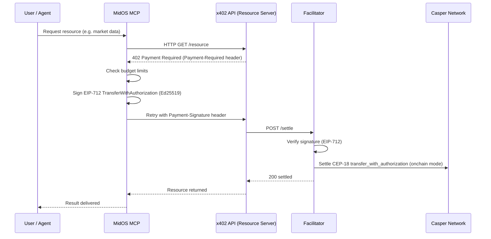
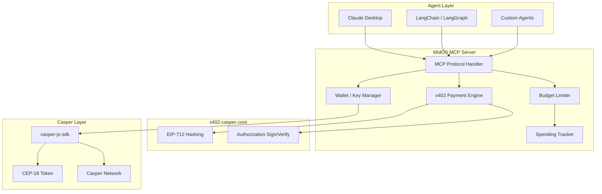

# MidOS

> An agentic payment wallet for Casper — give Claude or any agent a Casper wallet and let it pay for x402-gated APIs in under 60 seconds.


---

AI agents can reason. They can plan. They can execute.

But they cannot pay — until now.

**MidOS** is an MCP wallet that gives AI agents the ability to autonomously discover, authorize, and settle micropayments on **Casper** using the **x402 protocol**. Payments are signed off-chain as EIP-3009-style `TransferWithAuthorization` messages (EIP-712 typed data, Ed25519) — no API keys, no billing accounts, no human in the loop unless you want one.

Built for the [Casper Agentic Buildathon](https://dorahacks.io/hackathon/casper-agentic-buildathon).

---

## How It Works



---

## Architecture



The EIP-712 signing/verification logic lives in a shared package, [`x402-casper-core`](./packages/x402-casper-core), used by **both** the wallet (to sign) and the facilitator (to verify) — so they can never drift. The hashing is a byte-faithful port of [`casper-eip-712`](https://github.com/casper-ecosystem/casper-eip-712) (verified against the crate's own known-vector tests), so the same signature is valid on-chain.

---

## Installation

### Developers — JSON Config

Add to your Claude Desktop config file:

**macOS:** `~/Library/Application Support/Claude/claude_desktop_config.json`
**Windows:** `%APPDATA%\Claude\claude_desktop_config.json`

```json
{
  "mcpServers": {
    "midos": {
      "command": "npx",
      "args": ["-y", "midos-wallet-mcp"],
      "env": {
        "CASPER_SECRET_KEY": "your ed25519 secret key hex",
        "NETWORK": "casper-test",
        "MAX_PER_CALL": "1.0",
        "MAX_PER_DAY": "100.0"
      }
    }
  }
}
```

Restart Claude Desktop after saving.

### Build from source

```bash
git clone <repo> MidOS && cd MidOS
npm install            # installs all workspaces
npm run build          # builds x402-casper-core + the wallet → dist/index.js
```

---

## Environment Variables

| Variable | Required | Default | Description |
|---|---|---|---|
| `CASPER_SECRET_KEY` | Yes | — | Ed25519 secret key (hex, PEM contents, or path to a `.pem`) |
| `NETWORK` | No | `casper-test` | `casper`, `casper-test`, or `casper-nctl` |
| `CASPER_NODE_URL` | No | per-network | Override the RPC node URL |
| `X402_TOKEN_CONTRACT` | No | placeholder | CEP-18 contract package hash (`hash-<hex>`) — required for on-chain settlement |
| `X402_TOKEN_NAME` | No | `Casper X402 Token` | EIP-712 domain name (must match the facilitator) |
| `MAX_PER_CALL` | No | `1.0` | Max CSPR per single payment |
| `MAX_PER_DAY` | No | `100.0` | Daily spending cap (CSPR) |

---

## Tools Reference

### Wallet Operations

| Tool | Description |
|---|---|
| `check_balance` | View CSPR balance, public key, and account hash |
| `transfer_cspr` | Send native CSPR to any Casper account |
| `transfer_token` | Send a CEP-18 token on Casper |
| `request_funding` | Funding request with address + testnet faucet hint |
| `spending_report` | Per-call and daily spend audit trail |

### x402 Payment Protocol

| Tool | Description |
|---|---|
| `pay` | Sign a Casper x402 authorization → returns the `Payment-Signature` header |
| `x402_fetch` | Fetch any URL with automatic 402 payment handling |
| `search_bazaar` | Discover x402-gated services |

---

## Live, on-chain

A self-contained Casper x402 stack ships in
[`casper-x402`](./casper-x402): **Pulse**, a
pay-per-call data API, plus an on-chain settlement facilitator. Start both
(`npm run facilitator`, `npm run pulse`), then point an agent at a paid endpoint:

> "Get me the current weather in Tokyo from http://127.0.0.1:3002/v1/weather?city=Tokyo and pay for it."

What happens:

1. Agent calls the endpoint and gets `402 Payment Required` with a price
2. MidOS checks your budget, then submits a **real native CSPR transfer** to the seller
3. It waits for the transfer to finalize on Casper testnet
4. The facilitator **verifies the transfer on-chain** (recipient, amount, payer, no replay)
5. Agent retries with the `Payment-Deploy` proof and returns the live data + deploy hash

See [`RUNBOOK.md`](./RUNBOOK.md) for the full walkthrough (Claude Desktop and the
autonomous agent runner).

---

## Security

- **Budget limits** — configurable max per call and daily caps, enforced before any signature
- **Self-custody** — your Ed25519 key signs locally; nothing is sent to a backend
- **Spending tracker** — complete audit trail of every payment
- **EIP-712 typed data** — human-auditable, domain-separated authorizations
- **Replay & time-window protection** — random nonce + `validAfter`/`validBefore` on every authorization

---

## Why Casper

| | Casper |
|---|---|
| Gasless signature transfers | Native via CEP-18 `transfer_with_authorization` (EIP-3009 style) |
| Off-chain typed-data signing | `casper-eip-712` (EIP-712), Ed25519 / secp256k1 |
| Predictable fees | Yes |
| Account abstraction | On-chain agent identity without a human wallet |
| WebAssembly-native L1 | First L1 with a live x402 facilitator |

---

## Repo Layout

| Path | What |
|---|---|
| `src/` | MidOS MCP wallet server (TypeScript) |
| `src/tools/` | MCP tools (check_balance, pay, x402_fetch, transfer_cspr, …) |
| `packages/x402-casper-core/` | Shared EIP-712 + authorization sign/verify (single source of truth) |
| `casper-x402/` | Pulse data API + on-chain settlement facilitator + E2E client |

---

## Tech Stack

- **Language:** TypeScript (strict)
- **Runtime:** Node.js 18+
- **Protocol:** Model Context Protocol (MCP) + x402
- **Blockchain:** Casper (Testnet / Mainnet)
- **SDK:** [`casper-js-sdk`](https://github.com/casper-ecosystem/casper-js-sdk) v5
- **Signing:** EIP-712 typed data (port of `casper-eip-712`), Ed25519
- **Token:** CEP-18

---

## Acknowledgements

The Casper x402 design follows [`odradev/casper-x402-poc`](https://github.com/odradev/casper-x402-poc)
(Odra CEP-18 contract + facilitator) and [`casper-eip-712`](https://github.com/casper-ecosystem/casper-eip-712).

---

## License

MIT — see [LICENSE](./LICENSE)

---

Built for the [Casper Agentic Buildathon](https://dorahacks.io/hackathon/casper-agentic-buildathon).
